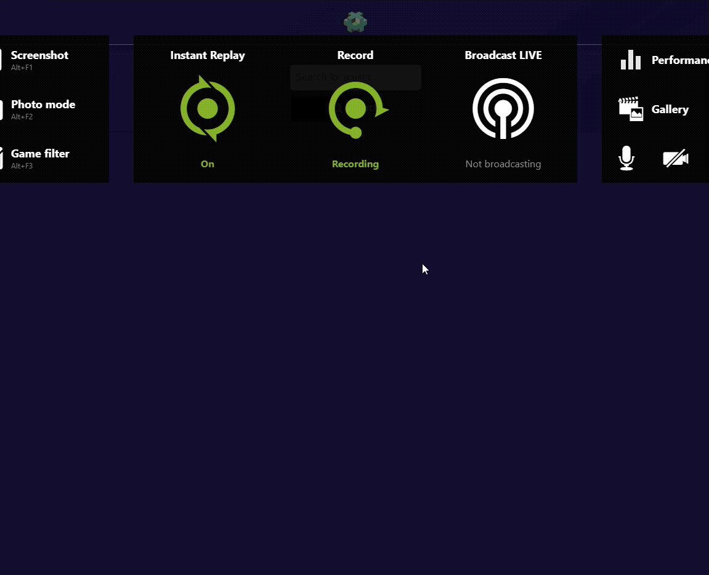
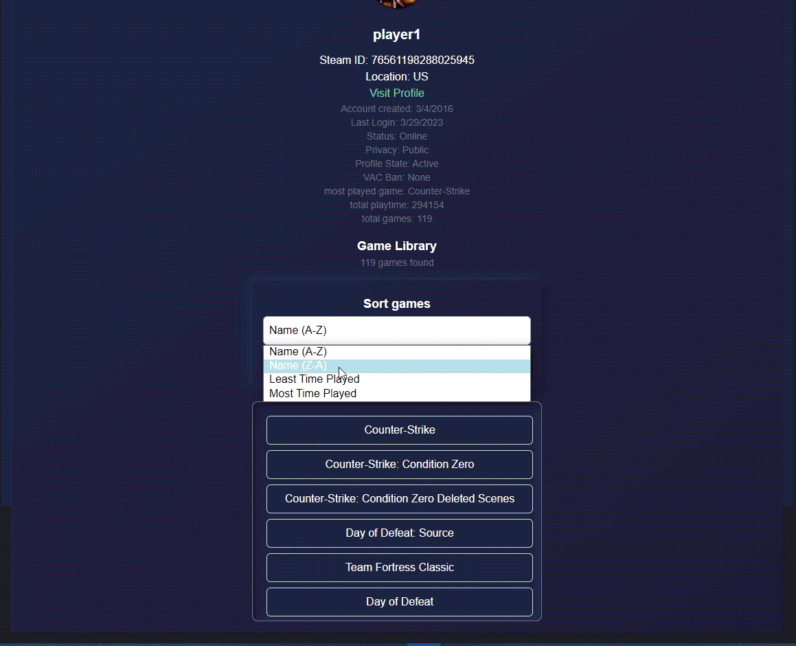

# Web Development Project 5 - *Steam Stats Dashboard*

Submitted by: **Matthieu Felker**

This web app: **This App is a dashboard that displays data fetched from the steam web API. The user can search for a steam user and see their profile information. The user can also filter through and sort the players game library**

Time spent: **16** hours spent in total

## Required Features

The following **required** functionality is completed:

- [x] **The list displays a list of data fetched using an API call**
- [x] **Data uses the useEffect React hook and async/await syntax**
- [x] **The app dashboard includes at least three summary statistics about the data such as**
  - [ ] *Account created, Last Login, Status, Privacy, Profile State, VAC Ban, most played game, total playtime, total games*
- [X] **A search bar allows the user to search for an item in the fetched data**
- [X] **Multiple different filters (2+) allow the user to filter items in the database by specified categories**

The following **optional** features are implemented:

- [ ] Multiple filters can be applied simultaneously
- [ ] Filters use different input types such as a text input, a selection, or a slider
- [ ] The user can enter specific bounds for filter values

The following **additional** features are implemented:

* [X] List anything else that you added to improve the site's functionality!
  
 - Tailwind css framework for styling
 - Set up node.js server to fetch data from steam api
 - Express server to serve the react app
 - Cors to allow cross origin requests

## Video Walkthrough

Here's a walkthrough of implemented user stories:

<!-- Replace this with whatever GIF tool you used! -->
GIF created with Geforce Experience.
<!-- Recommended tools:
[Kap](https://getkap.co/) for macOS
[ScreenToGif](https://www.screentogif.com/) for Windows
[peek](https://github.com/phw/peek) for Linux. -->

## Notes

So many challenges. Mainly learning how to use the steam api. I had to use a node.js server to fetch the data from the steam api. I also had to use cors to allow cross origin requests. I was not able to build exactly what I wanted but I think it is a good starting point. I would like to add more features in the future.

## License

    Copyright [2023] [Mattthieu Felker]

    Licensed under the Apache License, Version 2.0 (the "License");
    you may not use this file except in compliance with the License.
    You may obtain a copy of the License at

        http://www.apache.org/licenses/LICENSE-2.0

    Unless required by applicable law or agreed to in writing, software
    distributed under the License is distributed on an "AS IS" BASIS,
    WITHOUT WARRANTIES OR CONDITIONS OF ANY KIND, either express or implied.
    See the License for the specific language governing permissions and
    limitations under the License.