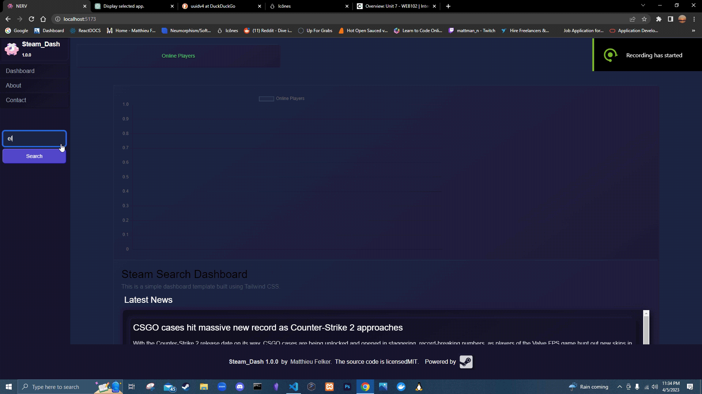

# Web Development Project 6 - *Name of App Here*

Submitted by: **matthieu felker**

This web app: **search through steam apps and display information about them. view online players and graph the number of players over time.**

Time spent: **20** hours spent in total

## Required Features

The following **required** functionality is completed:

- [ ] **The app includes at least two unique chart developed using the fetched data that tell an interesting story**
- [x] **Clicking on an item in the list view displays more details about it**
- [ ] **Clicking on an item has a direct, unique link to that item's detail view page**

The following **optional** features are implemented:

- [ ] The site's customized dashboard contains more content that explains what is interesting about the data
- [ ] The site allows users to toggle between different data visualizations

The following **additional** features are implemented:

* [ ] List anything else that you added to improve the site's functionality!

## Video Walkthrough

Here's a walkthrough of implemented user stories:

<!-- Replace this with whatever GIF tool you used! -->
GIF created with ...  
<!-- Recommended tools:
[Kap](https://getkap.co/) for macOS
[ScreenToGif](https://www.screentogif.com/) for Windows
[peek](https://github.com/phw/peek) for Linux. -->

## Notes

I cant get the charts to work. I tried using Chart.js and Google Charts but I couldn't get them to work. I also tried using the data from the API but I couldn't get that to work either. I'm not sure what I'm doing wrong.

also have a hard time passing state between components. I'm could not figure out how to pass the state and data from the Search results component to the dashboard spent 7 hours on this.

## License

    Copyright [yyyy] [name of copyright owner]

    Licensed under the Apache License, Version 2.0 (the "License");
    you may not use this file except in compliance with the License.
    You may obtain a copy of the License at

        http://www.apache.org/licenses/LICENSE-2.0

    Unless required by applicable law or agreed to in writing, software
    distributed under the License is distributed on an "AS IS" BASIS,
    WITHOUT WARRANTIES OR CONDITIONS OF ANY KIND, either express or implied.
    See the License for the specific language governing permissions and
    limitations under the License.